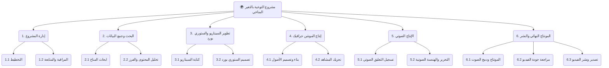

# 🌍 Earth in Danger: Unveiling the Truth Behind Climate Change

## 📌 Project Charter (ميثاق المشروع)

> [!NOTE]
> **ميثاق المشروع** يحدد الإطار العام والأهداف الاستراتيجية لمشروع التوعية بالتغير المناخي باستخدام الرسوم المتحركة (Motion Graphics).

### 📋 معلومات عامة عن المشروع (Project Information)

| 🔑 المسمى / الدور | 👤 الاسم |
| :---: | :---: |
| **اسم المشروع (Project Title)** | `Earth in Danger: Unveiling the Truth Behind Climate Change` |
| **راعي المشروع (Project Sponsor)** | **Dr. John Joseph** |
| **مدير المشروع (Project Manager)** | **Ziad Mahmoud Mohammed Sadawy** |
| **تاريخ ميثاق المشروع (Date)** | `June 16, 2026` |

---

### 👥 فريق العمل (Project Team Members)

* 👑 **Ziad Mahmoud Mohammed Sadawy** *(Team Leader & Project Manager)*
* 🎨 **Mostafa Yasseen Brakat** *(Team Member)*
* 📝 **Omnia Abdelaziz Albdelrahman** *(Team Member)*
* 🎬 **Sagdh Wael Mamdoh** *(Team Member)*
* 🔊 **Asmaa Ibrahim Mohamed** *(Team Member)*

---

### 📖 خلفية المشروع (Project Background)
> يعتبر التغير المناخي أحد أهم التحديات البيئية التي تواجه العالم اليوم. لقد أدت الأنشطة البشرية مثل حرق الوقود الأحفوري، وإزالة الغابات، والانبعاثات الصناعية إلى زيادة تركيزات غازات الاحتباس الحراري في الغلاف الجوي، مما أدى بدوره إلى الاحتباس الحراري وتدهور البيئة. 
> 
> يدرك العديد من الناس وجود التغير المناخي ولكنهم قد لا يفهمون أسبابه وعواقبهم بشكل كامل. لذلك، يهدف هذا المشروع إلى تقديم هذا موضوع بطريقة مبسطة وجذابة من خلال فيديو رسوم متحركة (Motion Graphics).

---

### 🎯 الغرض من المشروع (Project Purpose)
الهدف الأساسي من هذا المشروع هو **تثقيف ورفع مستوى الوعي العام** حول ظاهرة التغير المناخي، وأسبابها، وتأثيراتها، والحلول الممكنة لها من خلال إنتاج فيديو توعوي احترافي قصير يعتمد على الرسوم المتحركة.

---

### 🚀 أهداف المشروع (Project Objectives)

* 🧩 **التبسيط العلمي**: شرح مفهوم التغير المناخي بطريقة بسيطة ومفهومة للجميع.
* 🛢️ **تحديد المسببات**: تسليط الضوء على الأنشطة البشرية الرئيسية المساهمة في الاحتباس الحراري.
* 📈 **رفع الوعي**: زيادة الوعي البيئي والمسؤولية المجتمعية لدى الجمهور المستهدف.
* 🎨 **التمثيل البصري**: تقديم المعلومات العلمية بصرياً وجاذباً باستخدام تقنيات الموشن جرافيك.
* 🎬 **الإنتاج الاحترافي**: إنتاج فيديو توعوي قصير ذو جودة فنية وعلمية عالية.

---

### 🔍 نطاق المشروع (Project Scope)

| ✅ داخل النطاق (In Scope) | ❌ خارج النطاق (Out of Scope) |
| :---: | :---: |
| 🔹 جمع البيانات والأبحاث المتعلقة بالتغير المناخي. | 🔸 إجراء أبحاث علمية مناخية أصلية أو جديدة. |
| 🔹 كتابة السيناريو والحوار (Script Writing). | 🔸 صياغة أو تطوير سياسات بيئية حكومية. |
| 🔹 رسم وتخطيط الستوري بورد (Storyboard). | 🔸 إنتاج فيلم وثائقي طويل. |
| 🔹 تصميم الرسوم وتحريكها (Motion Graphics). | 🔸 إنتاج نسخ متعددة اللغات للفيديو (دبلجة/ترجمة). |
| 🔹 تسجيل التعليق الصوتي والتحرير الصوتي (Voice-over). | - |
| 🔹 المونتاج النهائي للعمل وعمليات الرندرة. | - |
| 🔹 نشر وعرض الفيديو التوعوي النهائي. | - |

---

### 📦 المخرجات الأساسية (Deliverables)

1. **الملخص البحثي**: أبحاث وبيانات التغير المناخي المعتمدة.
2. **السيناريو المكتوب**: النص النهائي للحوار والمشاهد.
3. **لوحة القصة (Storyboard)**: التصميم المبدئي لتتابع المشاهد.
4. **عناصر الرسوم المتحركة**: الأصول والرسومات المصممة خصيصاً للمشروع.
5. **الملف الصوتي**: تسجيل التعليق الصوتي الاحترافي (Voice-over).
6. **الفيديو النهائي**: فيلم التوعية المصدر بجودة عالية.
7. **التواريخ والتوثيق**: مستندات المشروع البرمجية ورفعها على مستودع GitHub.

---

### 📅 الجدول الزمني للمشروع (Project Timeline)

*⏱️ المدة الإجمالية للمشروع: **5 أسابيع***

```mermaid
gantt
    title خطة العمل الزمنية للمشروع (Project Timeline)
    dateFormat  X
    axisFormat %d
    section خطة التنفيذ
    الأسبوع الأول - جمع البيانات والأبحاث : active, w1, 0, 7
    الأسبوع الثاني - كتابة السيناريو وتصميم الستوري بورد : w2, 7, 14
    الأسبوع الثالث - تحضير وتصميم الرسومات : w3, 14, 21
    الأسبوع الرابع - التحريك وتسجيل التعليق الصوتي : w4, 21, 28
    الأسبوع الخامس - المونتاج النهائي والنشر والتوثيق : w5, 28, 35
```

---

### 💡 الافتراضات والقيود (Assumptions & Constraints)

#### 📝 الافتراضات (Assumptions)
* التزام جميع أعضاء الفريق بإنهاء المهام الموكلة إليهم في الأوقات المحددة.
* توفر البرامج والأجهزة المطلوبة لإتمام عمليات التصميم والمونتاج.
* سهولة الوصول إلى مصادر بيانات مناخية موثوقة وعلمية.

#### ⚠️ القيود (Constraints)
* **الوقت**: مدة المشروع محددة بـ 5 أسابيع فقط.
* **البشرية**: مدى تفرغ وتواجد أعضاء الفريق وتنسيق مواعيدهم.
* **التقنية**: الإمكانيات التقنية للأجهزة والبرامج المتاحة للفريق.

---

### 🏆 معايير النجاح (Success Criteria)

* 📅 **الالتزام بالوقت**: إنهاء المشروع بالكامل وتسليمه في الوقت المحدد طبقاً للجدول الزمني.
* 🎬 **الإنتاج الفني**: إنتاج وإخراج فيديو رسوم متحركة (Motion Graphics) بمستوى احترافي.
* 🔬 **الدقة العلمية**: الدقة العلمية وصحة المعلومات المقدمة حول ظاهرة التغير المناخي.
* 🏆 **التقييم الإيجابي**: الحصول على تقييمات وتعليقات إيجابية من المشرف والجمهور المستهدف.

---

### ✍️ الاعتماد والتوقيع (Approvals)

| 👤 صفة المعتمد | 🤝 الاسم | 📝 التوقيع / التاريخ |
| :---: | :---: | :---: |
| **راعي المشروع (Project Sponsor)** | **Dr. John Joseph** | ........................................ |
| **مدير المشروع (Project Manager)** | **Ziad Mahmoud Mohammed Sadawy** | ........................................ |

---

## ⚠️ Problem Statement (المشكلة)

> [!WARNING]
> التغير المناخي يهدد التوازن البيئي العالمي، والجهل بأسبابه يزيد من صعوبة مواجهته.

### 🚫 التحدي البيئي المتزايد (The Environmental Challenge)
أصبح تغير المناخ أحد أخطر التحديات البيئية التي تؤثر على العالم اليوم. الأنشطة البشرية مثل:
* 🛢️ **حرق الوقود الأحفوري** (Fossil Fuels)
* 🪓 **إزالة الغابات** (Deforestation)
* 🏭 **الانبعاثات الصناعية** (Industrial Emissions)
* ⚡ **الاستهلاك المفرط للطاقة** (Excessive Energy Consumption)

أدت جميعها إلى زيادة انبعاثات غازات الاحتباس الحراري بشكل كبير، مما تسبب في ظاهرة الاحتباس الحراري وعدم الاستقرار البيئي والمناخي.

### 📉 فجوة الوعي والمعرفة (The Awareness & Knowledge Gap)
على الرغم من التأثير المتزايد للتغير المناخي على النظم البيئية، وأنماط الطقس، والحياة البشرية، إلا أن **الكثير من الناس لا يزالون يفتقرون إلى فهم واضح لأسبابه وعواقبه**. ويرجع ذلك أساساً إلى:
1. **التعقيد العلمي**: غالباً ما تُعرض المعلومات البيئية بطريقة علمية معقدة ومملة.
2. **صعوبة الاستيعاب**: يصعب على عامة الناس غير المتخصصين استيعاب المصطلحات الجافة والأرقام الإحصائية المجردة.

### 💡 الحل المقترح (Our Proposed Solution)
يعالج هذا المشروع الحاجة الماسة إلى **طريقة مبسطة، جذابة، وبصرية لتثقيف الناس وتوعيتهم بالتغير المناخي**. 

من خلال فيديو توعوي يعتمد على **الرسوم المتحركة (Motion Graphics)**، يهدف المشروع إلى:
* تبسيط الأسباب والآثار المترتبة على التغير المناخي بلغة بصرية سهلة.
* تشجيع اتخاذ مواقف إيجابية لتعزيز الوعي والمسؤولية البيئية.

---

## 🎯 Project Objectives (أهداف المشروع)

> [!TIP]
> **الهدف الرئيسي للمشروع**: رفع مستوى الوعي العام حول قضية التغير المناخي وآثاره المدمرة على البيئة من خلال إنتاج فيديو رسوم متحركة (Motion Graphics) تفاعلي وجذاب.

### 📌 الأهداف التفصيلية (Specific Objectives)

* 🧩 **تبسيط المفاهيم**: شرح مفهوم التغير المناخي العلمي بطريقة بسيطة وسهلة الفهم للجميع.
* 🛢️ **تحديد الأسباب البشرية**: تسليط الضوء على الأنشطة البشرية الأساسية المسببة للاحتباس الحراري مثل حرق الوقود، إزالة الغابات، والانبعاثات الصناعية.
* 📈 **توسيع مدى الوعي**: تعزيز ورفع مستوى الوعي البيئي والاهتمام بقضايا البيئة لدى الجمهور المستهدف.
* 📖 **سرد القصص بصرياً**: توظيف أسلوب السرد القصصي البصري (Visual Storytelling) والرسوم المتحركة لعرض البيانات المعقدة بشكل مشوق.
* 🎬 **إنتاج محتوى احترافي**: تصميم وإنتاج فيديو توعوي قصير ذو جودة وإخراج فني عالي.
* 🌱 **تحفيز السلوك البيئي**: تشجيع الأفراد والمجتمع على تبني سلوكيات صديقة للبيئة تساهم في تقليل آثار التغير المناخي.
* 📅 **الالتزام بالخطة الزمنية**: تنفيذ جميع الأنشطة المطلوبة والإنتاج في غضون الجدول الزمني المحدد (5 أسابيع).

---

## 🤝 Stakeholder Analysis (تحليل أصحاب المصلحة)

### 👥 تحديد أصحاب المصلحة (Stakeholders Identification)

| 👤 صاحب المصلحة (Stakeholder) | 🛠️ الدور (Role) | 🎯 الاهتمام بالمشروع (Interest in the Project) | ⚡ التأثير (Influence) |
| :---: | :---: | :---: | :---: |
| **Dr. John Joseph** | راعي المشروع / المشرف | التأكد من جودة المشروع وتلبية المتطلبات الأكاديمية | **عالي (High)** |
| **Ziad Mahmoud Mohammed Sadawy** | قائد الفريق (Team Leader) | تنسيق أنشطة المشروع وإدارة أعضاء الفريق | **عالي (High)** |
| **أعضاء الفريق (Team Members)** | فريق عمل المشروع | مسؤولون عن تنفيذ المهام وتسليم مخرجات المشروع | **عالي (High)** |
| **الجمهور المستهدف (Target Audience)** | المستخدمون النهائيون | اكتساب الوعي والمعرفة حول قضية التغير المناخي | **متوسط (Medium)** |
| **الجامعة / القسم (Institution)** | المؤسسة الأكاديمية | دعم مخرجات التعلم التعليمية والبيئية | **متوسط (Medium)** |

---

### 📋 مسؤوليات أصحاب المصلحة (Stakeholder Responsibilities)

#### 👨‍🏫 راعي المشروع / المشرف (Dr. John Joseph)
* تقديم التوجيه العلمي والفني والملاحظات البناءة طوال فترة المشروع.
* تقييم تقدم المشروع والتحقق من جودة المخرجات النهائية.
* التأكد من تحقيق معايير الجودة الأكاديمية المطلوبة.

#### 👑 قائد الفريق (Ziad Mahmoud Mohammed Sadawy)
* إدارة جميع أنشطة وجوانب المشروع بشكل عام.
* توزيع المهام والمسؤوليات على أعضاء الفريق بشكل عادل ومناسب.
* متابعة سير خطة العمل الزمنية والتقدم المحرز في إعداد المخرجات.

#### 🎨 أعضاء الفريق (Team Members)
* إجراء أبحاث وجمع بيانات موثوقة حول ظاهرة التغير المناخي.
* كتابة السيناريوهات وتصميم لوحات القصة (Storyboards) بدقة.
* تصميم الرسوم وتطبيق عمليات التحريك (Animation) ومونتاج الفيديو.
* المشاركة الفعالة في تسجيل التعليق الصوتي والمراجعة النهائية للفيديو.

#### 👥 الجمهور المستهدف (Target Audience)
* مشاهدة الفيديو التوعوي والاستفادة من المعلومات المقدمة فيه.
* الاستفادة من التبسيط البصري للمعلومات البيئية لتطبيقها على أرض الواقع.

---

### 📅 خطة التواصل مع أصحاب المصلحة (Stakeholder Communication Plan)

| 👤 صاحب المصلحة | 📨 وسيلة التواصل (Communication Method) | ⏱️ التكرار (Frequency) |
| :---: | :---: | :---: |
| **المشرف (Instructor)** | الاجتماعات الدورية، البريد الإلكتروني، ومراجعة مخرجات العمل | أسبوعياً (Weekly) |
| **أعضاء الفريق (Team Members)** | الاجتماعات الحضورية، WhatsApp، ومنصات التعاون السحابية | يومياً / أسبوعياً (Daily/Weekly) |
| **الجمهور المستهدف (Audience)** | نشر وعرض فيديو الموشن جرافيك النهائي | عند اكتمال المشروع (Completion) |

---

## 🌳 Work Breakdown Structure (هيكل تقسيم العمل - WBS)

> [!TIP]
> يمثل هيكل تقسيم العمل (WBS) تفصيلاً هرمياً لكافة المهام والمسؤوليات اللازمة لإنجاز المشروع وتسليمه بنجاح خلال 5 أسابيع.

---

### 📝 التفاصيل التفصيلية لحزم العمل (Detailed WBS Packages)

#### 🗂️ 1. إدارة المشروع (Project Management)
* **1.1 تخطيط المشروع (Project Planning)**
  * تحديد أهداف وغايات المشروع العامة والخاصة.
  * توزيع الأدوار والمسؤوليات على أعضاء الفريق.
  * إعداد وتطوير الجدول الزمني لمهام المشروع.
* **1.2 مراقبة ومتابعة المشروع (Project Monitoring)**
  * تتبع تقدم المهام مقارنة بالجدول الزمني.
  * عقد الاجتماعات الدورية لمراجعة المشكلات وحلها.
  * مراجعة جودة المخرجات قبل الانتقال للمرحلة التالية.

#### 🔍 2. البحث وجمع البيانات (Research & Data Collection)
* **2.1 أبحاث التغير المناخي (Climate Change Research)**
  * جمع المعلومات والبيانات من مصادر علمية موثوقة.
  * تجميع وإحصاء البيانات والأرقام المناخية الأساسية.
* **2.2 تحليل وتصفية المحتوى (Content Analysis)**
  * تحديد الرسائل الأساسية التي يجب أن يركز عليها الفيديو.
  * اختيار الحقائق والأرقام الهامة والملهمة للجمهور.

#### 📝 3. تطوير السيناريو ولوحة القصة (Script & Storyboard Development)
* **3.1 كتابة السيناريو (Script Writing)**
  * كتابة المسودة الأولى لنص الفيديو (التعليق والوصف البصري).
  * مراجعة وتعديل محتوى النص لضمان وضوحه وسلاسته.
* **3.2 تصميم لوحة القصة (Storyboard Design)**
  * التخطيط البصري لكل مشهد من مشاهد الفيديو.
  * رسم وتصميم تسلسل المشاهد وحركة الكاميرا المبدئية.

#### 🎨 4. إنتاج الموشن جرافيك (Motion Graphics Production)
* **4.1 بناء الأصول والرسومات (Asset Creation)**
  * رسم وتصميم الأيقونات التوضيحية والرموز والرسومات الثابتة.
  * تصميم وتجهيز عناصر الخلفيات والبيئات المناسبة لكل مشهد.
* **4.2 التحريك والإنتاج (Animation)**
  * تطبيق عمليات التحريك على الأصول والرسوم المصممة.
  * إضافة المؤثرات البصرية الانتقالية (Transitions) والحركات السلسة.

#### 🔊 5. الإنتاج والهندسة الصوتية (Audio Production)
* **5.1 تسجيل التعليق الصوتي (Voice-over Recording)**
  * تحضير نص الإلقاء النهائي والتأكد من مخارج الحروف.
  * تسجيل الصوت بجودة عالية وباستخدام معدات هادئة ومناسبة.
* **5.2 تحرير الصوتيات (Audio Editing)**
  * معالجة الصوت وتنقيته من الضوضاء والتشويش.
  * مزامنة التوقيت الصوتي مع حركات الرسوم المتحركة في الفيديو.

#### 🎬 6. المونتاج النهائي والنشر (Final Editing & Publishing)
* **6.1 تحرير ومونتاج الفيديو (Video Editing)**
  * دمج المشاهد المتحركة مع التعليق الصوتي والمؤثرات الصوتية.
  * إضافة اللمسات والمؤثرات النهائية وتعديل الألوان.
* **6.2 مراجعة وضبط الجودة (Quality Review)**
  * التأكد من دقة المعلومات ومستوى جودة المونتاج.
  * تحديد الأخطاء وتعديلها وإصلاح المشكلات الفنية.
* **6.3 تصدير ونشر الفيديو (Publishing)**
  * تصدير الفيديو النهائي بالصيغة والجودة المناسبة.
  * رفع ملفات المشروع والتوثيق على مستودع GitHub.
  * تقديم وتسليم المشروع للمشرف الأكاديمي.

---

## 📅 Project Schedule (الجدول الزمني التفصيلي للمشروع)

| 📋 المهمة (Task) | 🗓️ الأسبوع 1 | 🗓️ الأسبوع 2 | 🗓️ الأسبوع 3 | 🗓️ الأسبوع 4 | 🗓️ الأسبوع 5 |
| :---: | :---: | :---: | :---: | :---: | :---: |
| **البحث وجمع البيانات (Research & Data Collection)** | 🟢 | - | - | - | - |
| **تحديد الرسائل الأساسية (Define Key Messages)** | 🟢 | - | - | - | - |
| **كتابة السيناريو (Script Writing)** | - | 🟢 | - | - | - |
| **تصميم لوحة القصة (Storyboard Design)** | - | 🟢 | - | - | - |
| **تحضير الأصول والرسوم (Asset Preparation)** | - | - | 🟢 | - | - |
| **تصميم الموشن جرافيك (Motion Graphics Design)** | - | - | 🟢 | - | - |
| **تحريك المشاهد وإنتاجها (Animation Production)** | - | - | - | 🟢 | - |
| **تسجيل التعليق الصوتي (Voice-over Recording)** | - | - | - | 🟢 | - |
| **مزامنة الصوت والتحريك (Audio Synchronization)** | - | - | - | 🟢 | - |
| **المونتاج النهائي للفيديو (Final Video Editing)** | - | - | - | - | 🟢 |
| **مراجعة وضبط الجودة (Quality Review)** | - | - | - | - | 🟢 |
| **التصدير والنشر النهائي (Export & Publishing)** | - | - | - | - | 🟢 |
| **الرفع والتوثيق على GitHub (GitHub Upload)** | - | - | - | - | 🟢 |

---

## ⚡ Risk Management (إدارة المخاطر)

> [!CAUTION]
> تحديد وتحليل المخاطر المحتملة بشكل استباقي يساعد في ضمان نجاح تسليم المشروع في موعده المحدد وتلافي العقبات التقنية والبشرية.

### 📋 جدول تقييم المخاطر (Risk Assessment Table)

| ⚠️ الخطر المحتمل (Risk) | 🎲 الاحتمالية (Probability) | 💥 الأثر (Impact) | 🛡️ استراتيجية التخفيف والحد (Mitigation Strategy) |
| :---: | :---: | :---: | :---: |
| **تأخر إنجاز المهام الموكلة** | 🟡 متوسط | 🔴 عالي | وضع جدول زمني واضح ومراقبة وتتبع المهام بانتظام |
| **نقص البيانات المناخية الموثوقة** | 🟢 منخفض | 🔴 عالي | الاعتماد الكلي على مصادر ومنظمات علمية وبيئية موثوقة |
| **أعطال البرامج أو المشكلات التقنية** | 🟡 متوسط | 🟡 متوسط | الاحتفاظ بنسخ احتياطية دورية واستخدام برمجيات بديلة عند الضرورة |
| **تدني جودة تسجيل الصوت (التعليق)** | 🟡 متوسط | 🟡 متوسط | التسجيل في بيئة معزولة وهادئة مع استخدام أدوات تنقية وهندسة صوت احترافية |
| **عدم تفرغ أو غياب أحد أعضاء الفريق** | 🟡 متوسط | 🔴 عالي | توزيع المهام بمرونة والحفاظ على قنوات اتصال مستمرة وسريعة |
| **ضيق الوقت المحدد للمشروع** | 🟡 متوسط | 🔴 عالي | الالتزام الصارم بالجدول الزمني المخطط وترتيب الأولويات للمهام الحرجة |

---

### 🛡️ خطة الاستجابة للمخاطر (Risk Response Plan)

* **المتابعة الدورية**: مراقبة وتقييم تقدم أنشطة ومخرجات المشروع بشكل أسبوعي.
* **التواصل الفعال**: الحفاظ على اجتماعات وتواصل دوري ومستمر بين جميع أعضاء الفريق.
* **النسخ الاحتياطي**: عمل نسخ احتياطية لكافة ملفات وتصاميم المشروع والسيناريوهات بشكل مستمر لتجنب فقدان البيانات.
* **مراجعة المخرجات**: مراجعة وتقييم الجودة لكل مرحلة عمل قبل البدء في المرحلة التي تليها.
* **الحلول البديلة**: تجهيز خيارات تقنية بديلة لمواجهة أي توقف مفاجئ للبرامج أو الأجهزة.

---

### 🔍 مراقبة المخاطر (Risk Monitoring)

> [!IMPORTANT]
> ستقوم إدارة المشروع وفريق العمل بمراجعة المخاطر المحتملة بشكل مستمر طوال دورة حياة المشروع، واتخاذ الإجراءات التصحيحية الفورية عند الحاجة لضمان اكتمال المشروع بأعلى كفاءة.

---

## 🎬 Storyboard (لوحة القصة البصرية)

> [!NOTE]
> توضح لوحة القصة التالية تتابع الأحداث البصرية للفيديو جنباً إلى جنب مع التعليق الصوتي المقابل لكل مشهد لتسهيل عملية التحريك والإنتاج.

| 🎬 المشهد (Scene) | 🖼️ التصور البصري على الشاشة (Visuals) | 🔊 التعليق الصوتي المصاحب (Narration) |
| :---: | :---: | :---: |
| **المشهد 1 (Scene 1)** | كوكب الأرض يدور في الفضاء مع غابات خضراء ومحيطات زرقاء مستقرة. | `"This is our planet... the home we all live in."` |
| **المشهد 2 (Scene 2)** | توسع المدن وتشغيل المصانع التي تطلق الدخان والسيارات الكثيرة. | `"But over time, humans began to develop their lives rapidly."` |
| **المشهد 3 (Scene 3)** | ارتفاع مؤشر درجات الحرارة، وذوبان الجليد، وارتفاع منسوب مياه البحار. | `"In recent years, Earth's temperature has begun to rise noticeably."` |
| **المشهد 4 (Scene 4)** | صورة مقربة لمداخن المصانع، عوادم السيارات، وحرق الوقود وقطع الأشجار. | `"So, what is the cause? Harmful gases are accumulating in the atmosphere."` |
| **المشهد 5 (Scene 5)** | أشعة الشمس تدخل الغلاف الجوي وتتحبس بداخله بسبب طبقة الغازات الضارة. | `"Sun rays are trapped around Earth more and more, causing global warming."` |
| **المشهد 6 (Scene 6)** | حرائق غابات ضخمة، أراضي متشققة من الجفاف، فيضانات تغرق شوارع، وحيوانات مشردة. | `"Over time, the Earth began to pay the price with natural disasters."` |
| **المشهد 7 (Scene 7)** | شخص ينظر بحزن للكاميرا مع تتابع مشاهد الكوارث الطبيعية أمامه. | `"And the problem is, all of this is happening right now, before our eyes."` |
| **المشهد 8 (Scene 8)** | مجموعة أشخاص يزرعون الأشجار، يركبون ألواح شمسية وتوربينات رياح، ويقللون التلوث. | `"Despite everything, we still have a chance to change the situation."` |
| **المشهد 9 (Scene 9)** | أرض نظيفة وسعيدة خضراء، وظهور شعار "مستقبل الأرض بين أيدينا". | `"Because the truth is simple: we are the cause, and we are also the solution."` |

---

## 🔊 Script & Voice Over (السيناريو والتعليق الصوتي التفصيلي)

> [!TIP]
> هذا هو النص المكتوب المعتمد للتعليق الصوتي والإلقاء الصوتي (Voice-over) مقسماً بحسب المشاهد.

### 🎙️ نص التعليق الصوتي (Voice-over Script)

* **🎬 المشهد الأول (Scene 1)**
  > 🌎 *This is our planet... the home we all live in. For millions of years, nature followed its natural balance. Forests grew, oceans were full of life, and the climate was stable.*
  > 
  > 🌍 (ده كوكبنا... البيت اللي عايشين فيه كلنا. على مدار ملايين السنين... الطبيعة كانت ماشية بتوازنها الطبيعي. الغابات بتكبر. والمحيطات مليانة حياة. والجو مستقر.)

* **🎬 المشهد الثاني (Scene 2)**
  > 🏭 *But over time, humans began to develop their lives rapidly. We built bigger cities, ran more factories, made millions of cars, and consumed more energy than ever before. All of this looked like progress... but it came with a price.*
  > 
  > 💨 (لكن مع مرور الزمن... الإنسان بدأ يطور حياته بسرعة. بنينا مدن أكبر. وشغلنا مصانع أكتر. وصنعنا ملايين العربيات. واستخدمنا طاقة أكتر من أي وقت فات. وكل ده كان شكله تطور... لكن كان ليه تمن.)

* **🎬 المشهد الثالث (Scene 3)**
  > 🏔️ *In recent years, Earth's temperature has begun to rise noticeably. Scientists have been recording record numbers year after year. Ice has begun to melt in many places around the world, sea levels are rising, and the weather has become more volatile than ever.*
  > 
  > 🌊 (في السنين الأخيرة... درجة حرارة الأرض بدأت تزيد بشكل واضح. والعلماء بقوا يسجلوا أرقام قياسية سنة ورا سنة. والجليد بدأ يدوب في أماكن كتير حوالين العالم. ومستوى البحار بدأ يرتفع. والطقس بقى متقلب أكتر من أي وقت فات.)

* **🎬 المشهد الرابع (Scene 4)**
  > 💨 *So, what is the cause? The reason is that harmful gases are accumulating in the atmosphere in large quantities. Gases coming from factories, cars, burning fuel, and deforestation.*
  > 
  > 🚗 (طب إيه السبب؟ السبب إن الغازات الضارة بقت بتتجمع في الغلاف الجوي بكميات كبيرة. غازات طالعة من المصانع. ومن العربيات. ومن حرق الوقود. ومن إزالة الغابات.)

* **🎬 المشهد الخامس (Scene 5)**
  > ☀️ *See these sun rays? In the past, a large part of their heat returned to space naturally. But now, the heat is trapped around Earth more and more. And this is what we call... global warming.*
  > 
  > 🌡️ (شايف أشعة الشمس دي؟ زمان جزء كبير من حرارتها كان بيرجع للفضاء بشكل طبيعي. لكن دلوقتي... الحرارة بقت بتتحبس حوالين الأرض أكتر وأكتر. وده اللي بنسميه... الاحتباس الحراري.)

* **🎬 المشهد السادس (Scene 6)**
  > 🔥 *Over time, the Earth began to pay the price. We started seeing huge wildfires, droughts hitting entire regions, floods submerging streets and cities, destructive storms causing massive losses, and many animals losing the places where they lived.*
  > 
  > 🌪️ (ومع الوقت... الأرض بدأت تدفع التمن. بدأنا نشوف حرائق غابات ضخمة. وجفاف بيضرب مناطق كاملة. وفيضانات بتغرق شوارع ومدن. وعواصف مدمرة بتسبب خسائر كبيرة. وحيوانات كتير فقدت الأماكن اللي كانت عادة عايشة فيها.)

* **🎬 المشهد السابع (Scene 7)**
  > 👁️ *And the problem is that none of this is happening far from us... it is all happening right now, right before our eyes.*
  > 
  > 👥 (والمشكلة إن كل ده مش بيحصل بعيد عننا... كل ده بيحصل دلوقتي. وقدام عينينا.)

* **🎬 المشهد الثامن (Scene 8)**
  > 🌱 *Despite everything that has happened, we still have a chance. A chance to change the situation. By using cleaner energy, planting more trees, reducing pollution, and conserving resources.*
  > 
  > ☀️ (ورغم كل اللي حصل... لسه عندنا فرصة. فرصة إننا نغير الوضع. باستخدام طاقة أنضف. وزراعة شجر أكتر. وتقليل التلوث. وترشيد استهلاك الموارد.)

* **🎬 المشهد التاسع (Scene 9)**
  > 🌏 *Because the truth is simple: we are the cause, and we are also the solution. The future of Earth is in our hands. This is our planet, and we must protect it.*
  > 
  > 🤝 (لأن الحقيقة بسيطة... إحنا السبب. وإحنا كمان الحل. ومستقبل الأرض... بين إيدينا. وده كوكبنا... ولازم نحافظ عليه.)

---

## 🏁 Conclusion (الخاتمة)

> [!IMPORTANT]
> **التغير المناخي** هو تحدٍ عالمي يؤثر على البيئة، والاقتصادات، والمجتمعات في جميع أنحاء العالم. ومن خلال هذا المشروع, قمنا باستكشاف الأسباب الرئيسية لتغير المناخ، وخاصة تلك المتعلقة بالأنشطة البشرية، وسلطنا الضوء على آثارها البيئية.

### 💡 أثر المشروع وأهدافه (Project Impact)
تم تطوير فيديو الرسوم المتحركة (Motion Graphics) لتبسيط المفاهيم المناخية المعقدة وتقديمها في قالب تفاعلي يسهل الوصول إليه وفهمه. ويهدف هذا المشروع من خلال زيادة الوعي وتشجيع السلوك البيئي المسؤول إلى:
* المساهمة في فهم أفضل لتغير المناخ ومسبباته.
* إلهام أفراد المجتمع لاتخاذ إجراءات إيجابية لحماية كوكبنا.

### 🤝 المسؤولية المشتركة (Collective Effort)
في الختام، تتطلب مواجهة تغير المناخ جهوداً جماعية متكاملة من:
1. **الأفراد** (من خلال ترشيد الاستهلاك وزراعة الأشجار).
2. **المجتمعات** (من خلال نشر الوعي والتعاون).
3. **الحكومات** (من خلال السياسات البيئية).

> *إن كل إجراء صغير نقوم به اليوم يمكن أن يسهم بفعالية في بناء مستقبل أكثر استدامة لكوكب الأرض.* 🌍💚
